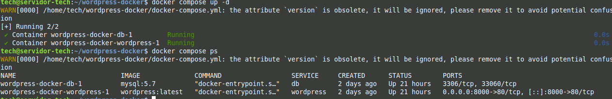
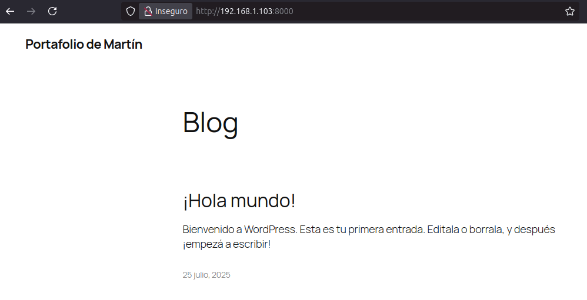

# Proyecto 5: Despliegue de WordPress con Docker y Docker Compose

## 1. Descripción del Proyecto

Este proyecto representa un salto hacia las prácticas modernas de DevOps, utilizando Docker para contenerizar una aplicación web completa. En lugar de instalar los servicios directamente en el sistema operativo del servidor, se empaquetó WordPress y su base de datos MySQL en contenedores aislados, definidos y gestionados a través de un único archivo `docker-compose.yml`.

Este enfoque ofrece enormes ventajas en portabilidad, escalabilidad y consistencia entre entornos de desarrollo y producción.

**Tecnologías Utilizadas:**
*   **Tecnología de Contenerización:** Docker Engine
*   **Orquestación de Contenedores (single-host):** Docker Compose
*   **Imágenes de Docker Utilizadas:** `mysql:5.7`, `wordpress:latest`

---

## 2. El Archivo `docker-compose.yml`

El núcleo de este proyecto es el archivo `docker-compose.yml`, que define la arquitectura de la aplicación como un conjunto de servicios interconectados.

Puedes ver el archivo de configuración completo aquí: **[docker-compose.yml](./docker-compose.yml)**

Las características clave de esta configuración son:
*   **Servicio `db`:** Un contenedor para la base de datos MySQL. Utiliza un **volumen de Docker (`db_data`)** para persistir los datos, asegurando que la información no se pierda si el contenedor se reinicia.
*   **Servicio `wordpress`:** Un contenedor para la aplicación WordPress.
    *   Depende explícitamente del servicio `db` (`depends_on`), garantizando el orden de arranque correcto.
    *   Mapea el puerto 8000 del host al puerto 80 del contenedor, permitiendo el acceso a la aplicación.
    *   Utiliza **variables de entorno** para pasar las credenciales de la base de datos de forma segura, sin tener que codificarlas en la imagen.

---

## 3. Despliegue y Verificación

El despliegue de toda la aplicación se simplifica a un único comando ejecutado en el directorio del proyecto:
```bash
docker compose up -d
```
Una vez ejecutado, se puede verificar que ambos contenedores están funcionando correctamente con el comando docker compose ps.



El resultado final es una instancia de WordPress completamente funcional, accesible a través del puerto mapeado en la IP del servidor.



## 4. Conclusiones

Este proyecto fue mi primera inmersión práctica en la contenerización. Me enseñó a pensar en las aplicaciones no como un conjunto de procesos en un servidor, sino como un conjunto de servicios independientes y portátiles.

Comprender Docker Compose es un paso fundamental para la gestión de aplicaciones modernas y sienta las bases para tecnologías de orquestación más avanzadas como Kubernetes.
